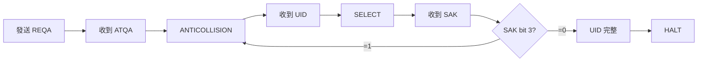

# RFID RC522 快速參考卡片

## 🔌 硬體連接

```
ESP32       RC522
------      ------
GPIO 23 --> MOSI
GPIO 25 --> MISO
GPIO 19 --> SCK
GPIO 22 --> SDA (CS)
3.3V    --> VCC  ⚠️ 不是 5V！
GND     --> GND
```

## 📋 關鍵暫存器速查表

| 地址 | 名稱 | 功能 | 常用值 |
|------|------|------|--------|
| 0x01 | CommandReg | 執行命令 | 0x0C (Transceive) |
| 0x06 | ErrorReg | 錯誤狀態 | 0x00 (無錯誤) |
| 0x09 | FIFODataReg | FIFO 資料 | 讀/寫資料 |
| 0x0A | FIFOLevelReg | FIFO 水位 | 清空: 0x80 |
| 0x0D | BitFramingReg | 位元框架 | REQA: 0x07 |
| 0x14 | TxControlReg | 天線控制 | 開啟: 0x83 |
| 0x26 | RFCfgReg | RF 增益 | 最大: 0x70 |
| 0x37 | VersionReg | 版本號 | 0x91/0x92 |

## 🔧 RC522 命令

| 命令碼 | 名稱 | 功能 |
|--------|------|------|
| 0x00 | Idle | 取消當前命令 |
| 0x0C | Transceive | 發送並接收 |
| 0x0E | MFAuthent | MIFARE 認證 |
| 0x0F | SoftReset | 軟體重置 |

## 📡 ISO 14443A 命令

| 命令 | 代碼 | 功能 |
|------|------|------|
| REQA | 0x26 | 請求（7 bits） |
| WUPA | 0x52 | 喚醒（7 bits） |
| ANTICOLLISION CL1 | 0x93 0x20 | 防碰撞 級別 1 |
| SELECT CL1 | 0x93 0x70 | 選擇 級別 1 |
| ANTICOLLISION CL2 | 0x95 0x20 | 防碰撞 級別 2 |
| SELECT CL2 | 0x95 0x70 | 選擇 級別 2 |
| HALT | 0x50 0x00 | 休眠 |

## 🎯 完整讀卡流程



## 💻 常用程式碼片段

### 讀取暫存器
```cpp
byte value = mfrc522->PCD_ReadRegister(MFRC522::VersionReg);
```

### 寫入暫存器
```cpp
mfrc522->PCD_WriteRegister(MFRC522::TxControlReg, 0x83);
```

### 檢測卡片
```cpp
if (mfrc522->PICC_IsNewCardPresent() && 
    mfrc522->PICC_ReadCardSerial()) {
  // 成功偵測
}
```

### 讀取 UID
```cpp
byte uidLength = mfrc522->uid.size;
for (byte i = 0; i < uidLength; i++) {
  byte uidByte = mfrc522->uid.uidByte[i];
}
```

### 卡片休眠
```cpp
mfrc522->PICC_HaltA();
mfrc522->PCD_StopCrypto1();
```

## 🐛 常見錯誤代碼

| ErrorReg Bit | 名稱 | 說明 |
|--------------|------|------|
| bit 0 | ProtocolErr | 協議錯誤 |
| bit 1 | ParityErr | 奇偶校驗錯誤 |
| bit 2 | CRCErr | CRC 錯誤 |
| bit 3 | CollErr | 碰撞（多張卡） |
| bit 4 | BufferOvfl | 緩衝區溢位 |
| bit 5 | TempErr | 溫度異常 |
| bit 6 | WrErr | 寫入錯誤 |

## 🔍 除錯檢查清單

### ✅ 硬體檢查
- [ ] VCC = 3.3V（不是 5V）
- [ ] GND 接好
- [ ] SPI 線 < 10cm
- [ ] MOSI/MISO 沒接反

### ✅ 軟體檢查
- [ ] VersionReg = 0x91 或 0x92
- [ ] TxControlReg bit 1:0 = 11（天線開啟）
- [ ] ErrorReg = 0x00
- [ ] CS 接腳設定正確

### ✅ 通訊檢查
- [ ] SPI 時鐘 < 10 MHz
- [ ] 使用 SPI Mode 0
- [ ] CS 正確拉低/拉高
- [ ] FIFO 有資料回應

## 📊 SAK 卡片類型對照

| SAK | 卡片類型 |
|-----|----------|
| 0x00 | MIFARE Ultralight |
| 0x08 | MIFARE Classic 1K |
| 0x09 | MIFARE Mini |
| 0x10 | MIFARE Plus |
| 0x18 | MIFARE Classic 4K |
| 0x20 | ISO 14443-4 (DESFire) |
| 0x28 | JCOP |

## ⚡ 效能優化

### 降低功耗
```cpp
// 軟體省電模式
mfrc522->PCD_WriteRegister(CommandReg, PCD_SoftPowerDown);

// 關閉天線
mfrc522->PCD_WriteRegister(TxControlReg, 0x00);
```

### 調整讀取距離
```cpp
// RFCfgReg[6:4] = 接收增益
// 0x07 = 48 dB（最遠，約 10cm）
// 0x04 = 33 dB（中等，約 5cm）
// 0x03 = 23 dB（最近，約 2cm）
mfrc522->PCD_WriteRegister(RFCfgReg, (0x07 << 4));
```

### 加快讀取速度
```cpp
// 縮短超時時間（預設 25ms）
mfrc522->PCD_WriteRegister(TReloadRegH, 0x01);
mfrc522->PCD_WriteRegister(TReloadRegL, 0x00);
```

## 🔐 安全性建議

⚠️ **UID 不適合做為唯一認證**
- UID 可以被複製（UID changeable 卡片）
- 建議搭配：
  - MIFARE 認證（金鑰）
  - 讀取加密扇區資料
  - 伺服器端二次驗證

⚠️ **預設金鑰容易被破解**
- 出廠預設：`FF FF FF FF FF FF`
- 建議更改為隨機金鑰

⚠️ **MIFARE Classic 1K 加密已破解**
- 使用 Proxmark3 可在數秒內破解
- 高安全性應用請改用 DESFire EV2

## 📚 進階資源

- **Datasheet**: [MFRC522.pdf](https://www.nxp.com/docs/en/data-sheet/MFRC522.pdf)
- **函式庫**: [github.com/miguelbalboa/rfid](https://github.com/miguelbalboa/rfid)
- **ISO 標準**: ISO/IEC 14443-3
- **破解工具**: [Proxmark3](https://github.com/RfidResearchGroup/proxmark3)

---

*快速參考卡片 v1.0 - 2026-01-30*
